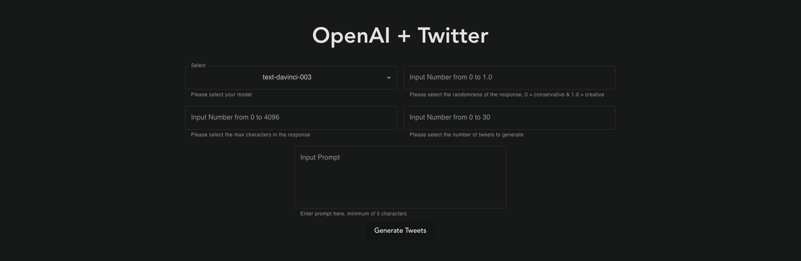
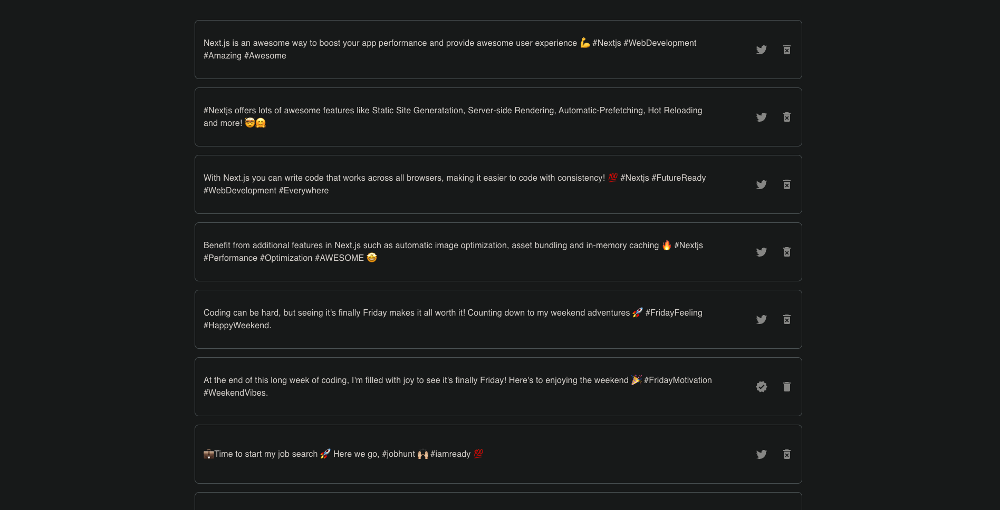

# OpenAI-Tweet-Blog
OpenAI-Tweet-Blog is a powerful and user-friendly application that utilizes the latest natural language processing technology from OpenAI to generate tweets and blog posts based on user input. With this application, users can easily create high-quality and engaging content for their Twitter profiles.

Users have the ability to store and review generated tweets, select the ones they want to post, and delete tweets from their Twitter account as well as from the stored list of generated tweets.

A future update will expand the app's capabilities to include the ability to generate blog type posts, and allow for seamless integration with LinkedIn, making it easy for users to manage their posts and reach their professional goals.

## Table of Contents
- [Tech Stack](#tech-stack)
- [Product Features](#product-features)
  - [GPT-3 Input Parameters](#gpt-3-input-parameters)
  - [Generated Tweet List](#generated-tweet-list)
- [Twitter](#twitter)

## Tech Stack

## Product Features

### GPT-3 Input Parameters

### Generated Tweet List

## Twitter

